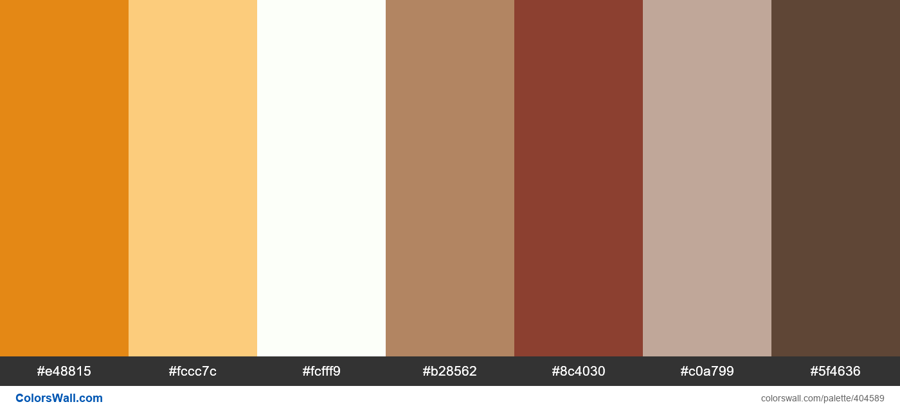

##  Diseño y Programación de Software Multiplataforma DPS104 G02T
### INTEGRANTES

Rodrigo Humberto Aguilera Mendoza AM201939
Ingeniería en Ciencias de la Computación
Universidad Don Bosco

### Notion del Proyecto:

[Notion](https://www.notion.so/c26972ff080d4e6cb4a7a4d930c9933f?v=8b2287715f8c4ce4aeb2ae7326ecb56d)`

### Figma de los Mockups:

[Figma](https://www.figma.com/design/ftH9AA0Zbh9wRoM16iVEjZ/Untitled?node-id=0-1&m=dev&t=BUNJgt7iN0Ho3u25-1)`

### Paleta de Colores:

*Paleta de Colores*
